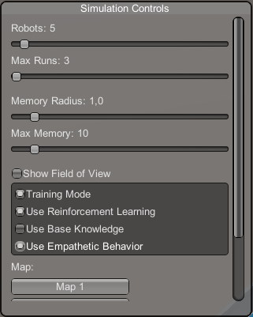

# Robot Swarm Simulator with Artificial Empathy

A Unity-based swarm simulation where autonomous robot agents cooperate, share knowledge, and learn empathetically to locate resources (food). Includes reinforcement learning, fuzzy-empathy modeling, and configurable simulation parameters.

---

## 🚀 Features

- **Autonomous Agents**: Robots navigate via Unity's `NavMeshAgent` and seek targets dynamically.
- **Artificial Empathy**: Agents share and adopt discovered information based on a fuzzy-similarity model.
- **Reinforcement Learning**: Q-learning with reward shaping and epsilon-greedy policy for adaptive behaviors.
- **Knowledge Persistence**: Food/no-food locations saved to text files for persistent memory across runs.
- **Configurable UI**: In-game debug panel to adjust robot count, toggle learning or knowledge modes, and control runs.
- **Performance Tracking**: Automatic logging of time-to-target for analysis and benchmarking.

---

## 📁 Repository Structure

```bash
/Robot simulator
├── Assets/                # Unity project folder
│   ├── Scripts
│   │   ├── Robot.cs
│   │   ├── RobotManager.cs
│   │   ├── KnowledgeBaseManager.cs
│   │   ├── PerformanceTracker.cs
│   │   ├── DebugSimulationUI.cs
│   │   └── CameraController.cs
│   └── ...                # Other Unity assets (Scenes, Prefabs, Materials)
├── Documentation/         # PDF Files
│   └── Simulation of empathetic robot.pdf
├── .gitignore
└── README.md              # ← You are here
```

---

## 🎯 Getting Started

### Prerequisites

- **Unity 2023.3** or later (LTS recommended)
- **.NET 4.x** scripting runtime
- Git (for cloning)

### Clone the Repository
IMPORTANT!!!
Remember to check if you are on a main branch
```bash
git clone https://github.com/JerKwi1/Robobond-2.0.git
```

### Open in Unity

1. Launch Unity Hub.
2. Click **Add** and select folder "Robot simulator" inside this project folder.
3. Open the project.
4. Open the main scene (e.g., `Assets/Scenes/Main.unity`).
5. Press **Play** to run the simulation in the Editor.

### Run the Compiled Build

1. Navigate to Realeses and download latest zip file.
2. On Windows, double-click `RobotSwarm.exe`.

## DebugSimulationUI Controls

When you run the Unity scene or .exe file, the **Debug Simulation UI** window (top-left corner) displays all of the following controls. Use these to tweak agent behavior, map selection, and logging at runtime.



1. **Robots (slider)**  
   - **Label:** `Robots: {number}`  
   - **Range:** 1 – 100  
   - **Description:** Sets how many agent GameObjects (`Robot`) will be spawned when you start the simulation. Moving this slider up increases swarm size; moving it down reduces it.

2. **Max Runs (slider)**  
   - **Label:** `Max Runs: {number}`  
   - **Range:** 1 – 1000  
   - **Description:** Specifies how many back-to-back simulation runs (episodes) the `RobotManager` should execute before automatically resetting. For example, if you set this to 10, the system will run 10 complete “go-find-food” trials in a row and then reset everything.

3. **Memory Radius (slider)**  
   - **Label:** `Memory Radius: {value:F1}`  
   - **Range:** 0.1 – 10 (world units)  
   - **Description:** Defines the radius (in Unity units) around each agent’s position that gets marked as “visited” or “no-food.” Any cell within this circle will be stored in the robot’s local memory (up to `Max Memory`). Larger values mean each visit “paints” a bigger area; smaller values force finer granularity.

4. **Max Memory (slider)**  
   - **Label:** `Max Memory: {number}`  
   - **Range:** 1 – 100  
   - **Description:** Limits how many distinct world-space points (or “memories”) each `Robot` can store before the oldest entry is discarded. Once a robot’s memory buffer is full, hitting a new “visited” location will drop the earliest remembered point.

5. **Show Field of View (toggle)**  
   - **Label:** `Show Field of View`  
   - **On/Off (checkbox)**  
   - **Description:** When enabled, each agent’s vision cone (i.e., its sensor frustum or raycast field) is drawn in-scene as a debug overlay. Useful to verify exactly which obstacles or other agents your code considers “in view.”

6. **Parameter Box (boxed toggles)**  
   Inside the gray box in the middle of the UI, you’ll see four checkboxes:

   - **Training Mode**  
     - **Label:** `Training Mode`  
     - **On:** Each time you **Reset** or **Stop** the simulation, every agent writes its current Q-table to `trained_model.json`.  
     - **Off:** At startup, each agent loads `trained_model.json` (if it exists) but will not overwrite it when stopping. Use this to preserve previously learned Q-values without dumping new data.

   - **Use Reinforcement Learning**  
     - **Label:** `Use Reinforcement Learning`  
     - **On:** Agents will run their Q-learning loop—choosing actions via ε-greedy, updating Q-values, and so on.  
     - **Off:** Agents ignore Q-learning and behave only via “base logic” (pure exploration or hardcoded fallback), effectively disabling learning for this run.

   - **Use Base Knowledge**  
     - **Label:** `Use Base Knowledge`  
     - **On:** Agents will consult pre-saved knowledge (a list of known “food” and “no-food” coordinates) before moving. This causes them to preferentially navigate toward any stored food locations or avoid known barren areas.  
     - **Off:** Agents never check the base-knowledge table and rely solely on RL (if enabled) or pure exploration.

   - **Use Empathetic Behavior**  
     - **Label:** `Use Empathetic Behavior`  
     - **On:** Each agent will periodically call `DetectNearbyRobots()`, compute fuzzy-similarity, and—if the similarity score exceeds 0.7—adopt a peer’s discovered food/no-food entries. This enables dynamic, distance-based information sharing.  
     - **Off:** Agents never share knowledge with one another mid-simulation; they learn only from their own sensors and Q-updates.

   > **Tip:** Toggling any of these checkboxes will immediately apply that change to all **existing** robots currently in the scene (no need to hit “Reset” or “Stop”). You’ll see a console log like  
   > ```  
   > [UI] Applied toggles → Training:True  RL:False  BaseKB:True  Empathy:False  
   > ```  
   > whenever one of these is flipped.

7. **Map Selection (grid of buttons)**  
   - **Label:** `Map:`  
   - Shows a vertical list of all available map names (pulled from `RobotManager.mapRoots`).  
   - **Clicking a map name:**  
     1. Immediately calls `RobotManager.Instance.ActivateMap(newIndex)` to switch the NavMesh/obstacle layout.  
     2. If the simulation is already running, it also calls `ResetToInitial()`, effectively restarting on the new map.

8. **Start / Reset / Stop Buttons**  
   - **Start Simulation** (`▶ Start Simulation`)  
     - **Visible when** the simulation is not running.  
     - **Behavior:**  
       1. Calls `ApplySettings()`, which pushes the current slider and toggle values into `RobotManager` and into every `Robot` in the scene (setting fields like `memoryRadius`, `useReinforcementLearning`, `useBaseKnowledge`, and `showFOV`).  
       2. Calls `RobotManager.Instance.StartSimulation()`, which spawns the requested number of `Robot` objects (using the chosen map, RL/base-knowledge settings, etc.) and begins the first run.

   - **Reset Simulation** (`⟳ Reset Simulation`)  
     - **Also visible when** the simulation is not running.  
     - **Behavior:**  
       1. Calls `Robot.SaveModelNow()`, which forces each agent to dump its Q-table or any learned data to disk.  
       2. Calls `RobotManager.Instance.ResetToInitial()`, which destroys all current robots and respawns them (using the same parameter settings) but resets episode counters to zero.  
       3. Sets the `isSimulationRunning` flag to **false** (ready to start again).

   - **Stop Simulation** (`■ Stop Simulation`)  
     - **Visible when** the simulation _is_ running.  
     - **Behavior:**  
       1. Calls `Robot.SaveModelNow()` to write out Q-tables.  
       2. Calls `RobotManager.Instance.ResetToInitial()`, clearing all agents and stopping the current run.  
       3. Sets the `isSimulationRunning` flag back to **false** so you can reconfigure sliders/toggles or restart.

---

## ⚙️ Configuration

- **DebugSimulationUI** panel (in-game UI):
  - Toggle **Reinforcement Learning** and **Knowledge Mode**.
  - Adjust **Robot Count**, **Simulation Runs**, and **Memory Settings**.
  - **Start**, **Stop**, and **Reset** simulation controls.

- **KnowledgeBaseManager** files (in `PersistentDataPath`):
  - `KnowledgeBase.txt` (food locations)
  - `NoFoodAreas.txt` (empty searches)

- **RobotManager**:
  - Configure total runs, spawn positions, and logging path.

---
## 📂 Generated Files & Output Locations

When you run the simulator (Editor or standalone), several files are created under your **persistent data path** (`System.Application.persistentDataPath`).
Typically on Windows it's in the same folder where your exe file is.
While you use Unity editor it will appear under Assets folder.

```bash
| Filename               | Purpose                                                       |
|------------------------|---------------------------------------------------------------|
| `trained_model.json`   | Flat Q-table (state,action→value) saved/loaded.               |
| `KnowledgeBase.txt`    | List of “food found” positions (`x,y,z` per line).            |
| `NoFoodAreas.txt`      | List of “no food” zones (`x,y,z` per line).                   |
| `SimulationResults.txt`| Logged simulation times: “Simulation N completed in T seconds.” |
```
